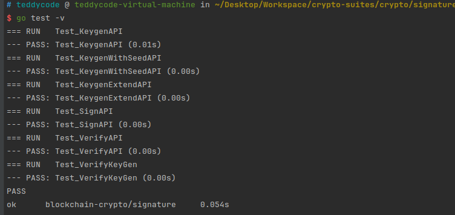
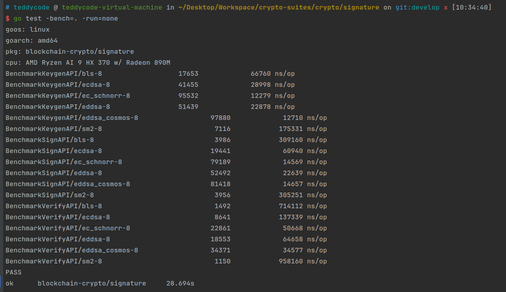

golang 签名库，详见[这里](./signature/README.md)

### 测试结果

### Legacy Tests
- Some historical compatibility tests are tagged with `legacy` and are excluded from default `go test ./...`.
- Run them manually with: `go test -tags legacy ./...`
