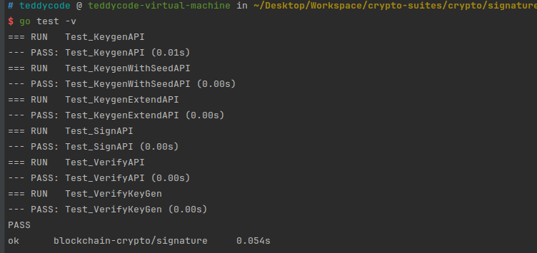
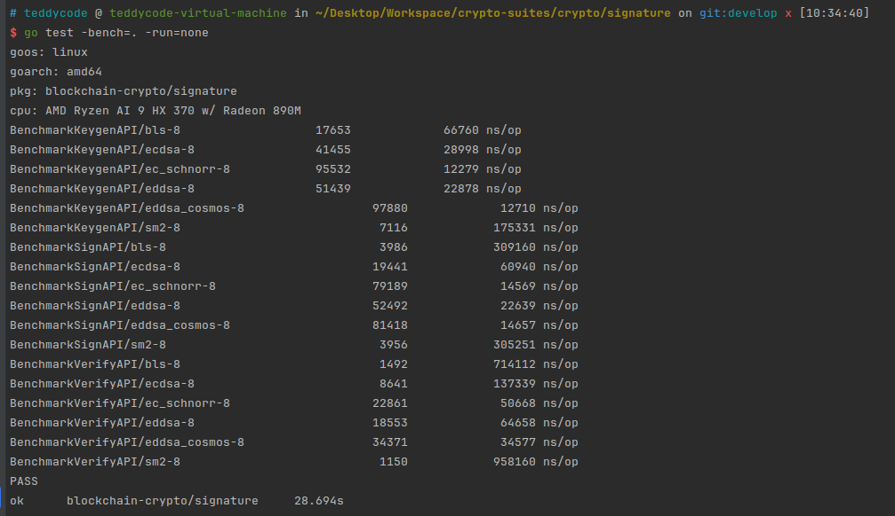

## github.com/19231224lhr/CryptoArea/crypto

`crypto/` 是 `CryptoArea` 仓库中面向 Go 项目的主模块，模块名为：

```go
module github.com/19231224lhr/CryptoArea/crypto
```

如果你是外部钱包或账户系统接入方，推荐优先使用：

```go
import "github.com/19231224lhr/CryptoArea/crypto/walletcrypto"
```

### 外部项目最小接入

```powershell
go mod init your-project
go get github.com/19231224lhr/CryptoArea/crypto@<tag-or-commit>
go mod tidy
```

如果你只是普通外部接入，不需要默认添加本地 `replace`。

### 下载源码后的本地接入

如果你已经把 `CryptoArea` 仓库下载到本地，也可以直接接入本地源码。

需要注意：

- `import` 仍然建议写模块路径
- 不建议把 `import` 改成磁盘路径
- 本地接入主要通过 `replace` 或 `go work`

示例：

```go
replace github.com/19231224lhr/CryptoArea/crypto => /path/to/CryptoArea/crypto
replace github.com/19231224lhr/CryptoArea/pqcgo => /path/to/CryptoArea/pqcgo
```

`walletcrypto` 当前提供：

- 经典签名算法接口
- 后量子签名算法接口
- 地址生成
- KEM
- keystore
- 常用哈希/HMAC/随机工具
- Seed-chain（哈希链一次一钥）辅助

### 快速验证

```powershell
go test ./walletcrypto/...
```

### Seed-chain 示例

```powershell
go run ./examples/walletcrypto-seedchain-demo
```

这个示例默认使用 `ecdsa`，便于在无 cgo 环境下直接运行；要切换到 PQ 流程，只需要把算法换成 `walletcrypto.AlgPQMLDSA` 并启用 `CGO_ENABLED=1`。

### 更多说明

- 根仓库总览：[`../README.md`](../README.md)
- 外部使用指南：[`../docs/external-usage-guide.md`](../docs/external-usage-guide.md)
- 经典签名实现说明：[`./signature/README.md`](./signature/README.md)

### 测试结果



### Legacy Tests
- Some historical compatibility tests are tagged with `legacy` and are excluded from default `go test ./...`.
- Run them manually with: `go test -tags legacy ./...`

