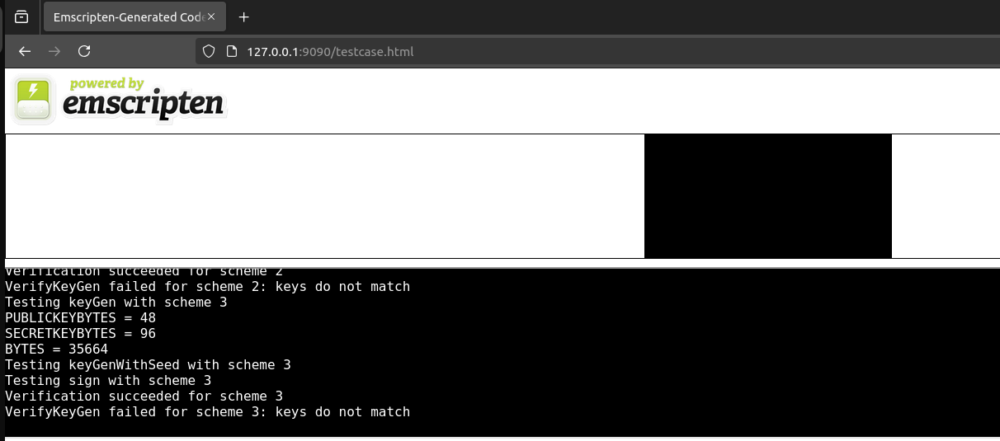

# 浏览器环境下的密码库

### 0. 环境准备
1. golang
-  安装go 1.22.9
- 复制gowasm胶水代码到assets目录下(版本要对应)
```shell
cp "$(go env GOROOT)/misc/wasm/wasm_exec.js" ~/go/bin/webassembly/assets/  
```
2. clang
安装Emscripten
```shell
git clone ...
```
3. others
 - Git
 - Python 3
 - Node.js

### 1. 编译wasm

1. 编译golang传统密码库
```shell
cd crypto
 ./build.sh
```
在tests/assets目录下生成了crypto.wasm文件
2. 编译c后量子密码库

wasm/pqcc下以编译好，如需手动编译，请参考[这里](wasm/pqcc/README.md)
在tests/assets目录下生成了pqcsign.*文件

### 2.在浏览器中测试
- 启动web服务器
```shell
cd tests/server && go run main.go 
```
- 打开浏览器

打开浏览器访问http://localhost:9090/index.html 测试传统签名算法，
> 请打开浏览器的开发者工具，查看console输出(未给出算法测测试逻辑,只有简单的调用测试)

打开浏览器访问http://localhost:9090/testcase.html 测试后量子签名算法

